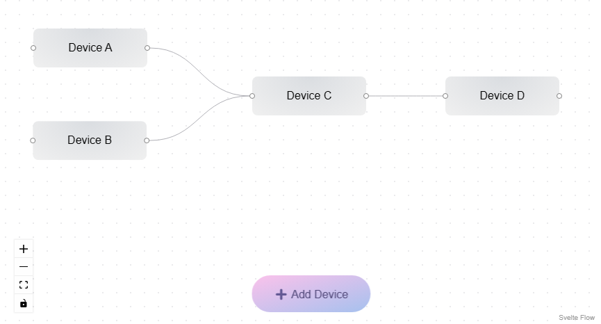

# signal-chain-frontend

Frontend of a signal chain board demo application.

## Overview

With this application you can
- Create devices on a board
- Rename / move them
- Link them together
- Delete them

All changes are communicated to the corresponding backend application (separate repository).



## Running the app

First, install dependencies:

```bash
npm install
```

Then, create a .env file in the root directory and set the backend URL:

```bash
# .env file
API_BASE_URL="http://localhost:8080"
```

Start the development server:

```bash
npm run dev

# or start the server and open the app in a new browser tab
npm run dev -- --open
```

## Building

To create a production version of the app:

```bash
npm run build
```

You can preview the production build with `npm run preview`.

> To deploy the app, you may need to install an [adapter](https://kit.svelte.dev/docs/adapters) for the target environment.

## Tools used

- [Svelte / SvelteKit](https://kit.svelte.dev/)
- [Vite](https://vitejs.dev/)
- [Svelte Flow](https://svelteflow.dev/)
